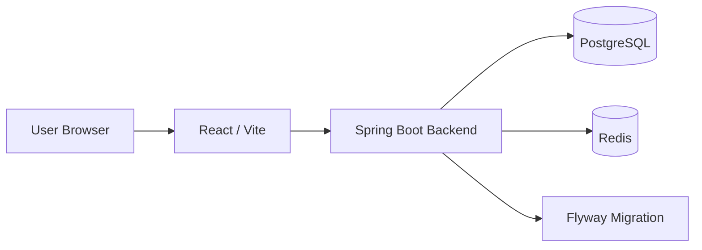
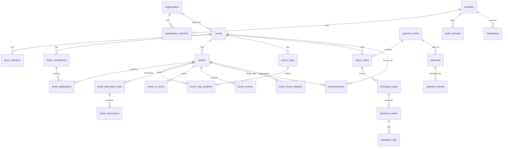

# Eventoday

## 📌 프로젝트 소개

Eventoday는 박람회, 전시회, 행사 운영을 위한 통합 플랫폼입니다.

기획 문서 기준으로는 행사 등록, 부스 모집, 참가기업 신청, 부스 배정, 평면도, 티켓 주문, 결제, 교환코드, 입장 QR, 부스 예약, 광고, 통계까지 포함하는 서비스를 목표로 합니다.

현재 checkout 기준으로 확인되는 구현 범위는 다음과 같습니다.

- Backend: Spring Boot 기반 프로젝트, JPA Entity/Enum, Flyway V1 DB 스키마
- Frontend: React/Vite 기반 정적 화면 프로토타입
- Infra: Docker Compose 기반 PostgreSQL, Redis

현재 BE 코드에는 Controller, Service, Repository, Request/Response DTO, SecurityConfig, Exception/ErrorCode 구현이 없으므로 API 동작은 아직 현재 코드에서 확인되지 않습니다. 상세 판단 기준은 `docs` 문서의 “현재 코드 기준 검토 결과”를 따릅니다.

## 📅 개발 기간

- 문서상 WBS 기준 기간: 2026-08-03 ~ 2026-08-24
- 현재 문서 정리 기준일: 2026-08-26

담당자별 실제 시작일, 종료일, 완료율은 코드만으로 확정할 수 없어 README에서 임의로 보정하지 않았습니다.

## 👥 팀원 및 역할

역할분담안과 WBS에 기록된 기준입니다.

| 팀원 | 주요 담당 영역 |
| --- | --- |
| 김찬호 | 공통, 인증, 조직, 알림, 배포 기반 |
| 정용쿠 | 행사, 플랫폼 심사, 광고 |
| 민동현 | 부스 모집, 부스 관리, 평면도 |
| 강현민 | 부스 신청, 파일, 공지/자료, 통계 |
| 이원건 | 티켓, 결제, 환불, 교환코드, 입장 QR |
| 장수호 | 모바일 안내, 관심 부스, 부스 예약, 혼잡도, 후기 |

## ✨ 주요 기능

현재 DB/Entity 기준으로 모델링이 확인되는 기능입니다.

- 회원/조직 관리
- 행사 등록 및 상태 관리
- 행사 담당자 및 현장 스태프 역할 관리
- 부스 모집 공고
- 부스 등록, 배정, 상태 관리
- 평면도 및 부스 좌표 관리
- 부스 신청 및 첨부파일
- 공지/자료 콘텐츠
- 티켓 주문, 결제 주문, 결제, 환불
- 교환코드 발급 요청 및 교환코드
- 입장권 및 입장 처리 로그
- 관심 부스
- 부스 예약 슬롯 및 예약
- 부스 QR 스캔
- 부스 후기
- 내부 알림
- 행사/부스 광고
- 부스 시간대별 통계

현재 checkout 기준 미확인 또는 미구현으로 보는 항목:

- 실제 OAuth/JWT 인증 흐름
- API 요청/응답 처리
- 결제 승인/웹훅/환불 Service
- 교환코드 발급/사용 Service
- QR 생성/검증/스캔 처리 Service
- Redis 예약 선점 로직
- 메일/푸시 알림 발송 로직
- 통계 배치 및 광고 노출 로직

## 🛠 기술 스택

**Backend**

- Java 21
- Spring Boot 4.1.0
- Spring Data JPA
- Spring Data Redis
- Spring Security
- OAuth2 Client
- Flyway
- PostgreSQL Driver
- Lombok
- Gradle

**Frontend**

- React 18
- Vite 5
- React Router DOM
- Tailwind CSS

**Infra**

- Docker Compose
- PostgreSQL 17
- Redis 7

**Test**

- JUnit Platform
- Spring Boot Test
- Testcontainers

## 🏗 시스템 아키텍처

현재 저장소 구조 기준 아키텍처입니다.



현재 FE에는 실제 API client 계층이 확인되지 않으며, BE에도 Controller 계층이 없기 때문에 위 구조는 목표 구조 및 인프라 연결 기준으로 봅니다.

## 🗃 ERD

현재 실제 DB Source of Truth는 `BE/src/main/resources/db/migration/V1__init_schema.sql`입니다.



총 29개 테이블이 V1 migration에 정의되어 있습니다. 자세한 컬럼, FK, UK, CK, 인덱스는 `docs/테이블명세서.md`를 확인하세요.

## 📡 API 명세

API 설계 문서는 `docs/Eventoday API 명세서.md`에 있습니다.

현재 checkout 기준 유의사항:

- BE에 Controller가 없어 실행 가능한 API 엔드포인트는 확인되지 않습니다.
- 문서의 API 목록, Request, Response는 현재 코드 구현이 아니라 설계 명세로 구분합니다.
- 인증/권한은 enum 이름만 확인되며 실제 Security 설정은 현재 코드에 없습니다.

## 📂 프로젝트 구조

```text
eventoday/
├── BE/
│   ├── build.gradle
│   ├── settings.gradle
│   └── src/
│       ├── main/
│       │   ├── java/com/min/edu/
│       │   │   ├── admission/domain/
│       │   │   ├── advertisement/domain/
│       │   │   ├── booth/domain/
│       │   │   ├── event/domain/
│       │   │   ├── file/domain/
│       │   │   ├── member/domain/
│       │   │   ├── notification/domain/
│       │   │   ├── organization/domain/
│       │   │   └── payment/domain/
│       │   └── resources/
│       │       ├── application.properties
│       │       └── db/migration/V1__init_schema.sql
│       └── test/
├── FE/
│   ├── package.json
│   └── src/
│       ├── components/
│       └── pages/
├── docs/
│   ├── Eventoday API 명세서.md
│   ├── Eventoday WBS.csv
│   ├── Eventoday 역할분담안.md
│   ├── Eventoday 요구사항명세서.md
│   └── 테이블명세서.md
├── docker-compose.yml
├── .env.example
└── README.md
```

## 🚀 실행 방법

### 사전 요구사항

- JDK 21
- Node.js 20 이상 권장
- Docker / Docker Compose

### 1. 환경 변수 준비

기본값을 그대로 사용할 경우 `.env` 없이도 실행 가능합니다. 값을 바꾸려면 `.env.example`을 참고해 `.env`를 생성합니다.

```bash
cp .env.example .env
```

Windows PowerShell에서는 다음처럼 복사할 수 있습니다.

```powershell
Copy-Item .env.example .env
```

### 2. PostgreSQL, Redis 실행

```bash
docker compose up -d
```

### 3. Backend 실행

```bash
cd BE
./gradlew bootRun
```

Windows PowerShell:

```powershell
cd BE
.\gradlew.bat bootRun
```

Flyway migration은 애플리케이션 기동 시 적용됩니다.

### 4. Frontend 실행

```bash
cd FE
npm install
npm run dev
```

### 5. 테스트

```bash
cd BE
./gradlew test
```

현재 테스트는 Testcontainers를 사용하므로 Docker 사용 가능 환경이 필요합니다.

## 🔐 환경 변수

`.env.example` 기준 현재 확인되는 환경 변수입니다.

| 변수 | 기본값 | 설명 |
| --- | --- | --- |
| `POSTGRES_DB` | `eventoday` | PostgreSQL 데이터베이스명 |
| `POSTGRES_USER` | `root` | PostgreSQL 사용자 |
| `POSTGRES_PASSWORD` | `root` | PostgreSQL 비밀번호 |
| `POSTGRES_PORT` | `5432` | 로컬 PostgreSQL 포트 |
| `REDIS_PORT` | `6379` | 로컬 Redis 포트 |

`BE/src/main/resources/application.properties`에는 다음 기본값도 정의되어 있습니다.

| 항목 | 기본값 |
| --- | --- |
| `DB_URL` | `jdbc:postgresql://localhost:${POSTGRES_PORT:5432}/${POSTGRES_DB:eventoday}` |
| `REDIS_HOST` | `localhost` |

OAuth, JWT, 결제, 메일, 파일 스토리지 관련 런타임 환경 변수는 현재 checkout 기준 `.env.example`에서 확인되지 않습니다.

## 🌿 Git Convention

현재 저장소에는 PR 템플릿, Issue 템플릿, PR check workflow가 있습니다.

### Branch

```text
main
develop
feature/{domain}-{feature}
fix/{domain}-{issue}
refactor/{domain}-{target}
docs/{target}
```

예시:

```text
feature/event-create
feature/booth-application
fix/payment-confirm
docs/readme-update
```

### Commit

```text
feat: 새로운 기능
fix: 버그 수정
refactor: 리팩터링
docs: 문서 수정
test: 테스트 추가/수정
chore: 빌드, 설정, 단순 작업
```

예시:

```text
feat: 행사 도메인 엔티티 추가
fix: Flyway 스키마 제약조건 수정
docs: README 실행 방법 최신화
```

### Pull Request

- PR 생성 시 `.github/pull_request_template.md`를 사용합니다.
- 관련 Issue가 있으면 PR 본문에 연결합니다.
- 변경 범위, 테스트 결과, 문서 수정 여부를 함께 작성합니다.
- DB schema 변경 시 migration 파일과 테이블 명세서를 함께 확인합니다.
