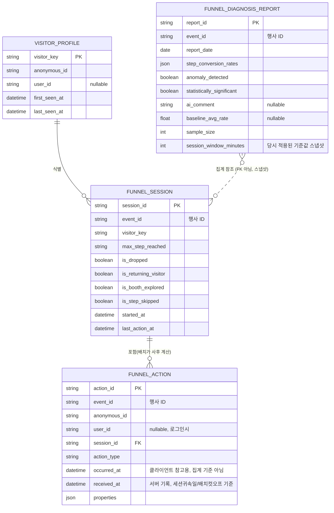
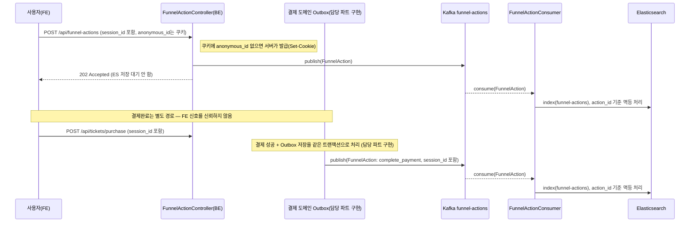
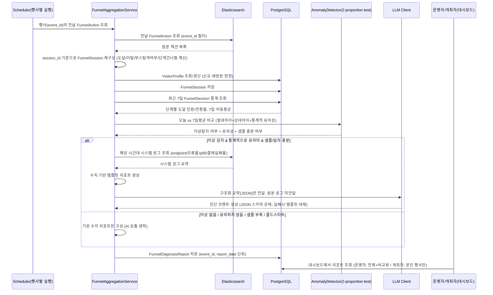

# 퍼널 기반 사용자 행동 분석 + AI 진단 — 기술 설계

기능 목적/범위/우선순위는 `requirements.md`, FE/BE/Kafka 이벤트 스펙은 `event-contract.md` 참고.

## 도메인 모델

### 액터

- **사용자(Visitor)**: 로그인 여부와 무관하게 티켓 구매 퍼널을 밟는 행위자. `anonymous_id` 또는 `user_id`로 식별.
- **개최자(Organization)**: 본인 행사의 퍼널 리포트를 조회하는 행위자.
- **운영자(Admin)**: 전체 행사의 퍼널 리포트 및 행사 간 비교 뷰를 조회하는 행위자.

### 핵심 개념 — 신규 Bounded Context `funnel-analytics`

기존 도메인(payment, event, organization 등)과 분리된 별도 패키지로 둔다.

| 개념 | 설명 |
|---|---|
| `FunnelAction` | 사용자 행동 1건의 원본 기록. 수정되지 않는 append-only 데이터 |
| `VisitorProfile` | `visitor_key` 단위 최초/최근 방문 시각. 신규/재방문 판정을 위한 조회용 |
| `FunnelSession` | 일일 배치가 `session_id` 기준으로 `FunnelAction`을 묶어 계산한 결과. 최대 도달 단계, 이탈 여부, 부스탐색 여부, 단계 건너뜀 여부 포함 |
| `FunnelDiagnosisReport` | 배치가 행사별·일자별로 생성하는 진단 결과 (전환율, 이상탐지 여부/통계적 유의성, AI 코멘트) |

### 보조/외부 시스템

- **Kafka**: 이벤트 버퍼 (결제 흐름과 분석 흐름 장애 격리)
- **Elasticsearch**: `FunnelAction` 원본 이벤트 + 시스템 로그를 저장/집계하는 엔진
- **PostgreSQL**: 배치가 계산한 파생 데이터(`VisitorProfile`, `FunnelSession`, `FunnelDiagnosisReport`) 저장
- **LLM API**: 진단 코멘트 생성 (설명 계층, 이상탐지 주체 아님)
- **기존 Payment 도메인**: Outbox 패턴으로 결제완료 이벤트를 신뢰성 있게 발행 (이 프로젝트 문서의 책임 범위 밖, 담당 파트 구현)
- **기존 Event/Organization 도메인**: 행사·주최자 관계의 실제 소스

## 저장소 배치

| 데이터 | 저장소 | 이유 |
|---|---|---|
| `FunnelAction` (원본 이벤트) | **Elasticsearch** | 대량 append 쓰기 + 시계열 집계(7일 이동평균 등)에 최적화된 엔진이 필요함 |
| 시스템 로그(에러율, 응답시간) | **Elasticsearch** | 기존 로그 수집기가 복제해 색인 (기존 로깅 코드 변경 없음), `FunnelAction`과 같은 저장소에 있어야 시간대 교차 조회가 쉬움 |
| `VisitorProfile` | **PostgreSQL** | 단순 key-value 조회(존재 여부 확인) 위주, 행 수가 방문자 수만큼이라 소규모. 기존 JPA 스택 재사용 |
| `FunnelSession` | **PostgreSQL** | 배치가 계산한 정형 데이터, 관계형 조회(필터링/페이징)가 자연스러움 |
| `FunnelDiagnosisReport` | **PostgreSQL** | 권한 필터링이 있는 일반적인 대시보드 조회(CRUD) 대상. 기존 Spring Security 인가 로직과 자연스럽게 결합 |

즉 **Elasticsearch는 "원본 이벤트를 대량으로 쌓고 집계하는 엔진"**, **PostgreSQL은 "배치가 계산한 최종
결과를 저장하고 서빙하는 저장소"**로 역할을 분리한다. 배치는 ES에서 읽어 계산한 뒤 PostgreSQL에 쓴다.

## 세션·식별자 정책

### anonymous_id 발급 주체

**서버(BE)가 발급한다.** `POST /api/funnel-actions` 요청에 `anonymous_id` 쿠키가 없으면 서버가 새로
생성해서 `Set-Cookie`(HttpOnly, 만료 1년)로 내려준다. FE는 별도 로직 없이 요청 시 `credentials: 'include'`
설정만 하면 되고, 쿠키 값 자체를 JS에서 다루지 않는다 (HttpOnly로 XSS 노출 최소화).

### 세션(session_id) 생성/관리

- FE가 클라이언트에서 랜덤 `session_id`(UUID)를 생성해 30분 비활동 시 새로 교체한다.
- 모든 행동 이벤트와 **결제 요청(`POST /api/tickets/purchase`)에도 동일한 `session_id`를 포함**시킨다.
  (결제완료를 원래 세션에 이어붙이기 위한 필수 조건 — `event-contract.md` 참고)
- 서버는 `session_id`의 형식만 검증하고, 세션 상태를 실시간으로 관리하지 않는다.
- `FunnelSession`은 **일일 배치가 원본 `FunnelAction`을 `session_id` 기준으로 묶어서 사후 계산**한다
  (실시간 세션 스토어 불필요).
- FE의 원본 `session_id`는 30분 무활동 기준으로만 교체되므로, 같은 브라우징 흐름(30분 이내)에서
  여러 행사를 오가면 **같은 `session_id`가 여러 행사에 걸쳐 재사용**될 수 있다. `FunnelSession`에는
  이 원본 값을 그대로 저장하지 않고 `{session_id}:{event_id}` 형태로 합쳐서 저장한다 — 그래야
  `funnel_session.session_id` 유니크 제약과 부딪히지 않고, 행사별로 독립된 세션 레코드가 만들어진다.

### "방문" 단계의 정의

퍼널 1단계 "방문"은 **별도의 이벤트 타입이 아니라, 세션의 존재 자체**로 판정한다. 즉 어떤 `session_id`로
`FunnelAction`이 하나라도 도착했다면, 그 세션은 자동으로 "방문" 단계에 도달한 것으로 계산한다.

이렇게 정의하는 이유: 사용자가 검색엔진 등을 통해 곧바로 행사상세 페이지로 진입하면 "방문"이라는 별도
화면 자체가 존재하지 않는다. 세션 시작 = 방문으로 보면 이런 진입 경로와 무관하게 항상 일관되게 계산된다.

### 신규/재방문 판정

- 세션 시작 시 해당 `visitor_key`(anonymous_id 또는 user_id 기준 통합 식별자)로 `VisitorProfile`이
  존재하는지 조회한다. 없으면 신규, 있으면 재방문으로 판정하고 `last_seen_at`을 갱신한다.
- 로그인 시 과거 `FunnelAction` 원본은 수정하지 않는다. `anonymous_id ↔ user_id` 매핑만 별도로 저장하고,
  집계 시점에 통합 `visitor_key`를 계산한다.
  (로그아웃·공용기기·쿠키 삭제로 인한 오인 가능성은 존재하며, 완전히 없앨 수 없다는 걸 인지하고 간다.)

## 집계 정책

### 도달/전환 계산 규칙

- 집계 단위는 **고유 세션 수**다. 이벤트 건수가 아니다.
- 같은 단계를 여러 번 조회해도 해당 세션은 그 단계에 1회 도달한 것으로 계산한다.
- 선행 단계 없이 후속 단계에 진입한 세션(예: 행사상세 없이 직접 결제)은 도달은 인정하되
  `is_step_skipped` 플래그를 남겨 별도로 구분한다.
- 세션 귀속일은 `started_at`(세션의 첫 액션이 **서버에 도착한 시각**, `receivedAt` 기준) 으로 하루를
  정한다. 클라이언트가 보낸 발생 시각(`occurredAt`)은 참고용일 뿐 집계 기준으로 쓰지 않는다
  (`event-contract.md`의 "occurredAt vs receivedAt" 참고).

### 배치 실행 스케줄

- **매일 03:00 (KST)에, 전날 00:00~23:59에 시작된 세션을 대상으로 배치를 실행**한다.
- 자정 직후 발생한 이벤트가 Kafka → Elasticsearch까지 색인되는 데 걸리는 지연, 그리고 결제 승인이
  약간 늦게 확정되는 경우까지 감안해 최소 3시간의 버퍼를 둔다.
- 배치 실행 시점까지 도착하지 않은 지연 이벤트는 해당 일자 리포트에 반영되지 않는다 (사후 소급 재계산은
  하지 않는다). 이는 알려진 제약으로 문서에 남긴다.

## 데이터 모델 (논리 ERD)

`FUNNEL_ACTION`은 Elasticsearch 인덱스, 나머지 셋은 PostgreSQL 테이블이다 (위 "저장소 배치" 참고).
`FUNNEL_DIAGNOSIS_REPORT`는 `(event_id, report_date)` 단위로 하루에 한 건씩 생성된다.

## 아키텍처 흐름

### ① 이벤트 수집 흐름

### ② 일일 배치 진단 생성 흐름 (매일 03:00 KST)

## 로컬 개발 환경

`docker-compose.yml`에 Elasticsearch 서비스가 아직 없다. 개발 시작 전 아래 스펙으로 추가가 선행되어야 한다.

- 단일 노드 구성 (`discovery.type=single-node`)
- 힙 최소 제한 (`ES_JAVA_OPTS=-Xms512m -Xmx512m` 수준, 로컬 개발용이라 소규모로 충분)
- 보안 기능 비활성화(`xpack.security.enabled=false`) — 로컬 전용이므로 인증 불필요
- 포트: 기본 9200 (다른 로컬 서비스와 충돌 시 `.env`의 다른 포트들처럼 환경변수로 오버라이드 가능하게)
- 별도 볼륨으로 데이터 유지 (`postgres_data`, `redis_data`, `minio_data`와 동일한 패턴)

(실제 `docker-compose.yml` 수정은 개발 시작 시 진행 — 이 문서는 스펙만 명시)
